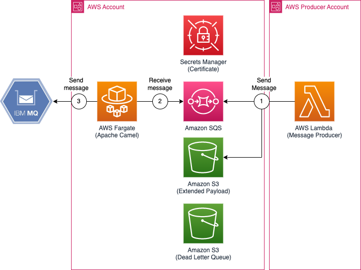
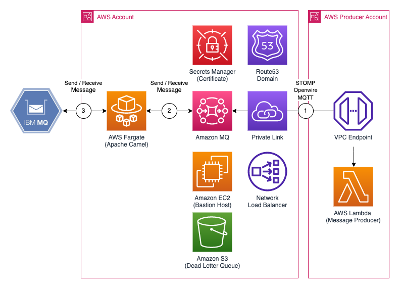

# MQ Adapter

Integration using Apache Cammel to connect IBM MQ systems to SQS, SNS and/or Amazon MQ.

## Architecture

You can setup multiple Apache Camel clusters to perform different IBM MQ integrations.

### Using Amazon SNS to receive messages



### Using Amazon SQS to send messages


### Using Amazon MQ to send and receive messages

Recommended when migrating existing applications or need to rely in industry standards protocols (AMQP, MQTT, STOMP, etc).



## Requirements

You need to have the following dependencies in place for the deployment:

* AWS Account (It's recommended to have one per environment such as development, integration and production)
* Mac OS / Cloud9 with Amazon Linux 2 Platform
* Bash/ZSH terminal
* Docker version > 20.10.x
* aws-cli v2 [here](https://docs.aws.amazon.com/cli/latest/userguide/getting-started-install.html)
* AWS credentials and profiles for each environment under ~/.aws/config [here](https://docs.aws.amazon.com/cli/latest/userguide/cli-configure-files.html)
* Node v16.14.* && NPM v8.11.*
* [yarn v1.x](https://classic.yarnpkg.com/lang/en/docs/install) e.g: 
  ```bash
    npm install --global yarn
  ```

## Getting Started

### 1. Boostrapping

#### Prerequisites

The following credentials are needed for client to connect to MQ:

* TrustStore
* TrustStorePassword
* KeyStore
* KeyStorePassword

#### Boostrap

Boostrap

1. Make sure you have the correct `AWS_PROFILE` and `AWS_REGION` environment variables. In case you have the latest version of Docker Desktop in your MacOs then make sure to export the following environment variables as well:
   `export DOCKER_BUILDKIT=0 export COMPOSE_DOCKER_CLI_BUILD=0`
2. Run `yarn cdk bootstrap --qualifier mq` to boostrap CDK within each of your AWS account.
3. If using Amazon MQ as target, setup resource policy for Amazon MQ to publish Cloudwatch Logs:
   `aws logs put-resource-policy --policy-name AmazonMQ-logs --policy-document '{ "Version": "2012-10-17", "Statement": [ { "Effect": "Allow", "Principal": { "Service": "mq.amazonaws.com" }, "Action":[ "logs:CreateLogStream", "logs:PutLogEvents" ], "Resource" : "arn:aws:logs:*:*:log-group:/aws/amazonmq/*" } ] }'`
4. Run `yarn install` to install CDK dependencies

#### Creating secrets

2. Generate the x509 certificates and AWS Secrets running the following commands under `app` folder:

```
cd app
# Generates X509 certificates
./deploy.sh generate_secrets
# Setup Secrets required for Camel broker (Replace <integration-name> with for example, dev)
./deploy.sh create_secrets broker <integration-name> 
# Setup Secrets for IBM MQ mock
./deploy.sh create_secrets mock
```
*IMPORTANT*: Update `cdk.json` with the "ARN" from the commands above.

You can skip last command if you're not deploying an IBM MQ Fargate mock (for example in a production enviroments).

#### (Optional) Updating secrets

3. You can always upload new version of AWS Secrets using:

```
cd app
# Upload local secrets for broker
./deploy.sh update_secrets broker $integration-name
# Upload local secrets for IBM MQ mock
./deploy.sh update_secrets mock
```

### 2. Set up configuration

2. Configure context (`cdk.json`) to specify environment and routes to enable (SQS, SNS or Amazon MQ). Example below:

```
"dev": {
      "accountId": "0123456788912",
      "region": "eu-west-1",
      "defaultVpcId": "vpc-0254abcde", // VPC used to deploy service
      "hostedZone": "fqdn-zone", // Optional: Route53 Zone (Public and Private) used for Amazon MQ integration
      "mock": { // secrets from step 2 
        "IBM_MOCK_PUBLIC_CERT_ARN": "arn:aws:secretsmanager:eu-west-1:0123456788912:secret:mqAdapterIbmMockPublicCert-wDwzCu",
        "IBM_MOCK_PRIVATE_CERT_ARN": "arn:aws:secretsmanager:eu-west-1:0123456788912:secret:mqAdapterIbmMockPrivateCert-Of0DPt",
        "IBM_MOCK_CLIENT_PUBLIC_CERT_ARN": "arn:aws:secretsmanager:eu-west-1:0123456788912:secret:mqAdapterIbmMockClientPublicCertARN-XMUB8Z"
      },
      "environments": {
        "dev-1": { // Integration example using AmazonMQ
          "allowedPrincipals" : ["arn:aws:iam::0123456788912:root"], // Principal to grant access to MQ VPC endpoint service exposing MQ and consumer secret 
          "envs": {
            "IBM_HOSTNAME": "10.0.0.7",  //IBM MQ Hostname (Configured when deploying mock)
            "IBMMQ_QUEUE_MANAGER": "QM1", //IBM MQ Queue Manager
            "IBMMQ_CHANNEL": "DEV.APP.SVRCONN", /IBM MQ Channel Name
            "IBMMQ_REQUEST_QUEUE": "DEV.QUEUE.1", / IBM Queue to read messages from
            "IBMMQ_RESPONSE_QUEUE": "DEV.QUEUE.2", // IBM Queue to write messages to
            "IBMMQ_TRUSTSTORE_ARN" : "arn:aws:secretsmanager:eu-west-1:0123456788912:secret:mqAdapterTrustStore-dev-JLt6r5",
            "IBMMQ_TRUSTSTORE_PASSWORD_ARN" : "arn:aws:secretsmanager:eu-west-1:0123456788912:secret:mqAdapterTrustStorePass-dev-YQrmtj", 
            "IBMMQ_KEYSTORE_ARN" : "arn:aws:secretsmanager:eu-west-1:0123456788912:secret:mqAdapterKeyStore-dev-eGCwfe", // Only needed when using mock
            "IBMMQ_KEYSTORE_PASSWORD_ARN" : "arn:aws:secretsmanager:eu-west-1:0123456788912:secret:mqAdapterKeyStorePass-dev-WLQFvK", // Only needed when using mock
            "AMAZONMQ_REQUEST_ROUTE_ENABLED": "true", //Enable MQ requests and response channels
            "AMAZONMQ_RESPONSE_ROUTE_ENABLED": "true",
            "AMAZONMQ_REQUEST_QUEUE": "DEV.QUEUE.1", // Amazon MQ Queue to write messages to
            "AMAZONMQ_RESPONSE_QUEUE": "DEV.QUEUE.2", // Amazon MQ Queue to read messages from
            "AMAZONMQ_CONSUMER_USERNAME": "dev-1" // Username for Amazon MQ
          }
        },
        "dev-2": {  // Integration example to write data to SNS
          "allowedPrincipals" : ["arn:aws:iam::0123456788912:root"],
          "envs": {
            "IBM_HOSTNAME": "10.0.0.7",  //IBM MQ Hostname (Configured when deploying mock)
            "IBMMQ_QUEUE_MANAGER": "QM1", //IBM MQ Queue Manager
            "IBMMQ_CHANNEL": "DEV.APP.SVRCONN", /IBM MQ Channel Name
            "IBMMQ_REQUEST_QUEUE": "DEV.QUEUE.3", // Which IBM MQ Queue to read data from
            "IBMMQ_TRUSTSTORE_ARN" : "arn:aws:secretsmanager:eu-west-1:0123456788912:secret:mqAdapterTrustStore-dev-JLt6r5",
            "IBMMQ_TRUSTSTORE_PASSWORD_ARN" : "arn:aws:secretsmanager:eu-west-1:0123456788912:secret:mqAdapterTrustStorePass-dev-YQrmtj",
            "IBMMQ_KEYSTORE_ARN" : "arn:aws:secretsmanager:eu-west-1:0123456788912:secret:mqAdapterKeyStore-dev-eGCwfe",
            "IBMMQ_KEYSTORE_PASSWORD_ARN" : "arn:aws:secretsmanager:eu-west-1:0123456788912:secret:mqAdapterKeyStorePass-dev-WLQFvK",
            "SNS_REQUEST_ROUTE_ENABLED": "true" //Enable SNS feature
          }
        },
        "dev-3": { // Integration example reading data back from SQS
          "allowedPrincipals" : ["arn:aws:iam::0123456788912:root"],
          "envs": {
            "IBM_HOSTNAME": "SPECIFIED_BY_MOCK", //IBM MQ Hostname (Configured when deploying mock)
            "IBMMQ_QUEUE_MANAGER": "QM1",
            "IBMMQ_CHANNEL": "DEV.APP.SVRCONN",
            "IBMMQ_RESPONSE_QUEUE": "DEV.QUEUE.4", // Which IBM MQ Queue to send data to
            "IBMMQ_TRUSTSTORE_ARN" : "arn:aws:secretsmanager:eu-west-1:0123456788912:secret:mqAdapterTrustStore-dev-JLt6r5",
            "IBMMQ_TRUSTSTORE_PASSWORD_ARN" : "arn:aws:secretsmanager:eu-west-1:0123456788912:secret:mqAdapterTrustStorePass-dev-YQrmtj",
            "IBMMQ_KEYSTORE_ARN" : "arn:aws:secretsmanager:eu-west-1:0123456788912:secret:mqAdapterKeyStore-dev-eGCwfe",
            "IBMMQ_KEYSTORE_PASSWORD_ARN" : "arn:aws:secretsmanager:eu-west-1:0123456788912:secret:mqAdapterKeyStorePass-dev-WLQFvK", 
            "SQS_RESPONSE_ROUTE_ENABLED": "true" //Enable SQS feature
          }
        }
      }
    },
```

3. Configure `defaultVpcId` with an existing vpc ID. If you're integrating to Amazon MQ, you also need to configure a `hostedZone` parameter.

*Note*: Separate integrations per channel to avoid Camel clusters noisy neighbours operations between routes (for example, request / response channels). This also supports better use of autoscaling functionality.

### 3. Deploying

1. Run `yarn cdk deploy '*-dev' --qualifier mq` to deploy solution in `dev` environment.

## How to access IBM MQ and Amazon MQ consoles

You can use a script to establish tunnels to both IBM MQ Mock or Amazon MQ and connect to their respective web consoles and send messages manually.
You can `test/connect.sh` script. Make sure your `AWS_PROFILE` and `AWS_REGION` environment variables are set (`export AWS_PROFILE='<ENTER_YOUR_CONFIGURED_AWS_PROFILE>'`´).

You need to setup the following environment variables for it to work:

* `IBM_ENDPOINT`: Endpoint for IBM MQ. Example: Network Load Balancer for IBM Mock (e.g mqmoc-mqada-1234567890.elb.eu-west-1.amazonaws.com)
* `AMAZONMQ_ENDPOINT`: Endpoint for Amazon MQ (e.g b-12345678-abcd-1234-abcd-abcd12345678-9.mq.eu-west-1.amazonaws.com)
* `BASTION_ID`: Instance ID for bastion (e.g i-abcd234567890abcd)

You can then log in to the console over `https://127.0.0.1:8162/` or `https://127.0.0.1:9443/` (if connecting to mock). For more information abut port forwarding: https://aws.amazon.com/de/blogs/mt/amazon-ec2-instance-port-forwarding-with-aws-systems-manager/.

You can login to the MQ Manager console `https://localhost:9443/admin` with default IBM password (`admin/passw0rd`). 

Login to Amazon MQ console (`https://localhost:8162`) with `camel` user name and the password stored in AWS Secrets Manager under `amazonMQPassword`. 

## How to test locally

Make sure your `AWS_PROFILE` environment variables are set so local application and IBM MQ retrieve secrets and publish/subscribe to events. Run `start.sh run` to start both app and IBM MQ using `docker-compose up ibm-mq-mock`.

Local tests require that routes are using either public routable services such as S3 or to configure a SSH tunnel through bastion (using `connect.sh`) to a private Amazon MQ. In the second case, configure your local DNS pointing `AMAZONMQ_ENDPOINT` to `127.0.0.1` to support SSL authentication.

YOu can also run camel from console or IDE using maven with following command line:
`camel:run -Dcom.ibm.mq.cfg.useIBMCipherMappings=false`

Check Camel app's README.md to see the variables you need to configure.

## How to run integration tests

### When integrating to AmazonMQ

1. In the IBM MQ console, access the local queue manager QM1 and under the corresponding DEV.QUEUE.
2. Send a message using `Hello AWS` to the `IBMMQ_REQUEST_QUEUE`. This message will be processed by AWS Fargate and published to Amazon MQ.
3. Access Amazon MQ console using connect.sh (`https://localhost:8162`) with `camel` user name and the password stored in AWS Secrets Manager under `amazonMQPassword`. Verify the message arrived in the corresponding `AMAZONMQ_REQUEST_QUEUE` queue specified in `cdk.json`. 
4. From Amazon MQ console, under `Queues`, select `Send To` to send a new message to the queue with: "Welcome to MQ Integration" message in the `AMAZONMQ_RESPONSE_QUEUE` queue.
5. Verify the message has arrived in the corresponding `IBMMQ_RESPONSE_QUEUE` in IBM MQ.

### When sending messages to SNS

1. In the IBM MQ console, access the local queue manager QM1 and open the DEV.QUEUE under `IBMMQ_REQUEST_QUEUE`.
2. Send a message using "Hello AWS". This message will be processed by AWS Fargate and published to SNS.
3. Access the SQS console and choose the `snsIntegrationStack` prefix queue. This is an SQS queue subscribed to the SNS topic for testing.
4. Select `Send and receive message`.
5. Select `Poll for messages` to see the "Hello AWS" message previously sent from IBM MQ.


### For reading messages from SQS

1.	Access the SQS console and choose the queue with the prefix `sqsPublishIntegrationStack`.
2.	Select `Send and receive messages`.
3.	For Message Body, add `Hello from AWS`.
4.	Choose `Send message`.
5.	In the IBM MQ console, access the local queue manager QM1 corresponding to `IBMMQ_RESPONSE_QUEUE` to find your message listed under this queue.

## Adding new stages

1. You can extend your `cdk.json` with new account stages such as `int` and `prod`. 
    * Define Camel configuration per stage under `app/resources/broker-<stage>.properties` files.
    * For Amazon MQ, specify Active MQ configuration per stage under `lib/conf/<stage>.xml`
2. Deploy via `cdk deploy '*-dev --qualifier mq`

*Note*: AWS recommends you to create a CDK pipeline using [`CDK Pipeline construct`](https://docs.aws.amazon.com/cdk/latest/guide/cdk_pipeline.html) to manage changes in your environment.

## Limitations

* IBM MQ only supports mutual TLS authentication.

## FAQ

* Where can I find Amazon MQ user credentials?

Credentials are stored in AWS Secrets Manager. There's a secret containing the admin MQ password (username: `camel`) and one for each integration configuration (specified under `AMAZONMQ_CONSUMER_USERNAME`).

* Why do I need specify the credentials in each IBM MQ integration (dev-1, dev-2, dev-3)? 

This enables you to integrate different IBM MQ clusters and use separate credentials between Camel clusters to reduce the blast radious.

* Where can I find an example `cdk.json` for Amazon MQ configuration? 

You can find the full examples to enable all Amazon SQS, SNS and MQ under `cdk.json.full`. 

## Security

See [CONTRIBUTING](CONTRIBUTING.md#security-issue-notifications) for more information.

## License

This project is licensed under the Apache-2.0 License.

